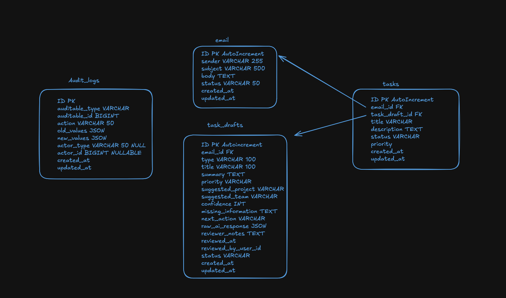
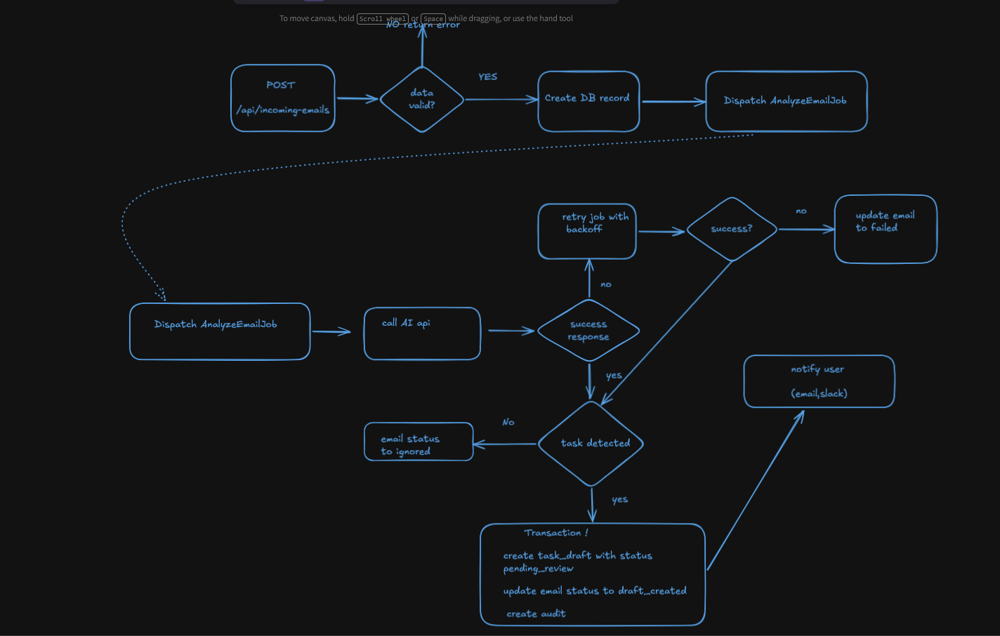
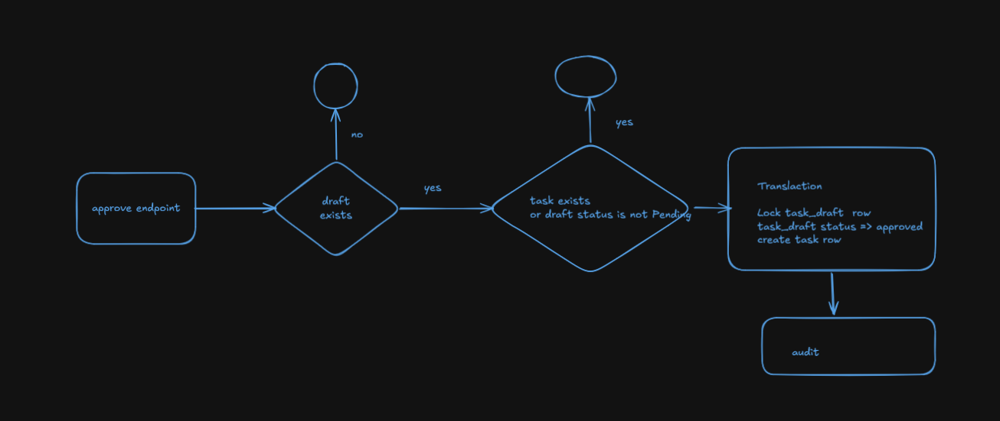
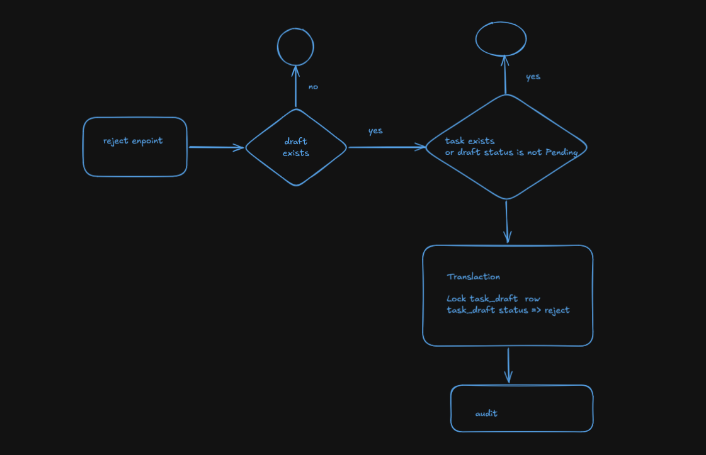
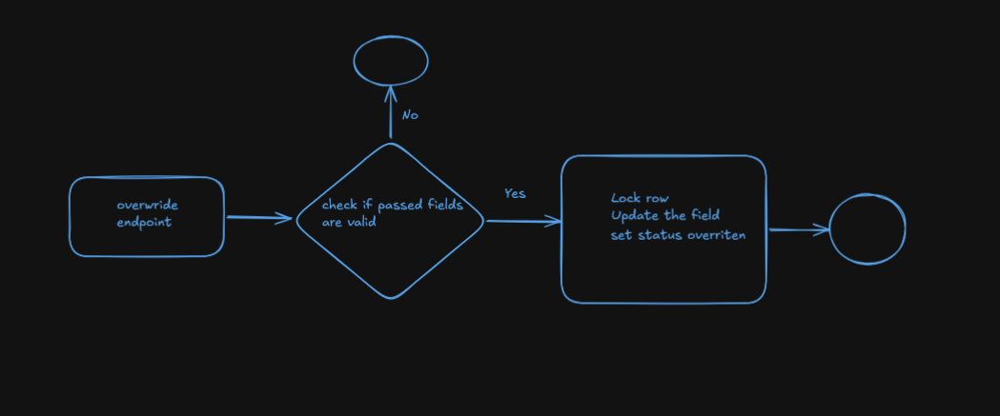

# ZETA

## Architecture
ZETA ingests inbound emails, analyzes them asynchronously with a pluggable AI client, and persists the suggestion as a **task draft** for a human to approve, reject, or override before it becomes a real **task**. Every write is recorded in `audit_logs` via repository decorators.

### Data model

`emails` → `task_drafts` (1:1, AI suggestion) → `tasks` (created on approve). `audit_logs` is a polymorphic trail for all of the above.

### Workflows
#### Email intake & analysis (`POST /api/incoming-emails`)

1. Request is validated; invalid payloads return `422`.
2. Email row is persisted with `status=pending`.
3. `AnalyzeEmailJob` is dispatched on the queue.
4. The job calls the AI client.
   - On failure → retry with backoff; after `tries` exhausted, set email `status=failed`.
   - On success, no task detected → set email `status=ignored`.
   - On success, task detected → in a single transaction create the `task_draft` (`pending_review`), set email `status=draft_created`, and write an audit log entry.
#### Approve (`POST /api/task-drafts/{id}/approve`)

Inside a transaction with `findForUpdate`:
- `404` if draft missing.
- `409` if status is not `pending_review` or a task already exists for the draft.
- Otherwise: set draft `status=approved`, insert the corresponding `tasks` row (`status=open`), audit both.
#### Reject (`POST /api/task-drafts/{id}/reject`)

Same guards as approve; on success the draft transitions to `status=rejected` and the change is audited. No `tasks` row is created.
#### Override (`POST /api/task-drafts/{id}/override`)

- Request validated via `OverrideTaskDraftRequest`; must contain at least one of `title`, `description`, `priority` (`low|medium|high|urgent`), `project`, `team`, `human_notes`.
- Draft row is locked, the provided fields are written (with key remapping, e.g. `description → summary`, `project → suggested_project`), and status is set to `overridden`.

## Local setup (Docker)

1. Ensure `src/.env.example` exists. On first Docker boot, the PHP entrypoint creates `src/.env` from it when `src/.env` is missing, then applies database-related variables from Compose. You can also copy it yourself before starting:

   ```bash
   cp src/.env.example src/.env
   ```

2. Start the stack (PHP-FPM, Nginx, MySQL, queue worker, phpMyAdmin):

   ```bash
   docker compose up -d --build
   ```

   The `queue` service runs `php artisan queue:work` so background jobs are processed. The `app` service runs migrations once on startup; the worker waits until the app is healthy before starting.

3. Open the app at [http://localhost:8080](http://localhost:8080) (override with `APP_PORT`).

## Local setup (without Docker, from `src/`)

```bash
cd src
composer run setup
```

This installs dependencies, requires `.env.example`, creates `.env` from it when missing, generates the app key, runs migrations, and builds front-end assets. Start a queue worker in another terminal:

```bash
cd src
php artisan queue:work
```

For a single dev command that includes a queue listener, use `composer run dev`.
